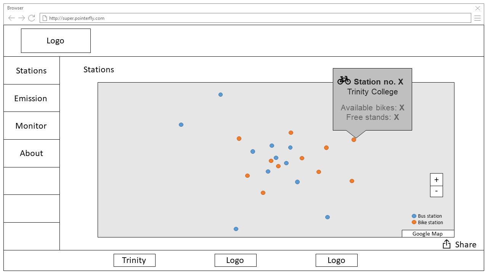

# GitLearning

## Required

* Install Pycharm and Django, set up local development evironment
* Write a basic website just like this.

* Send a pull request under the folder of your name.
* Use raw js, css, no libraries or frameworks are allowed.

## Optional

* Give it some dynamic features by Django if possible.
* Use sqlite or XML if possible. (ORM)
